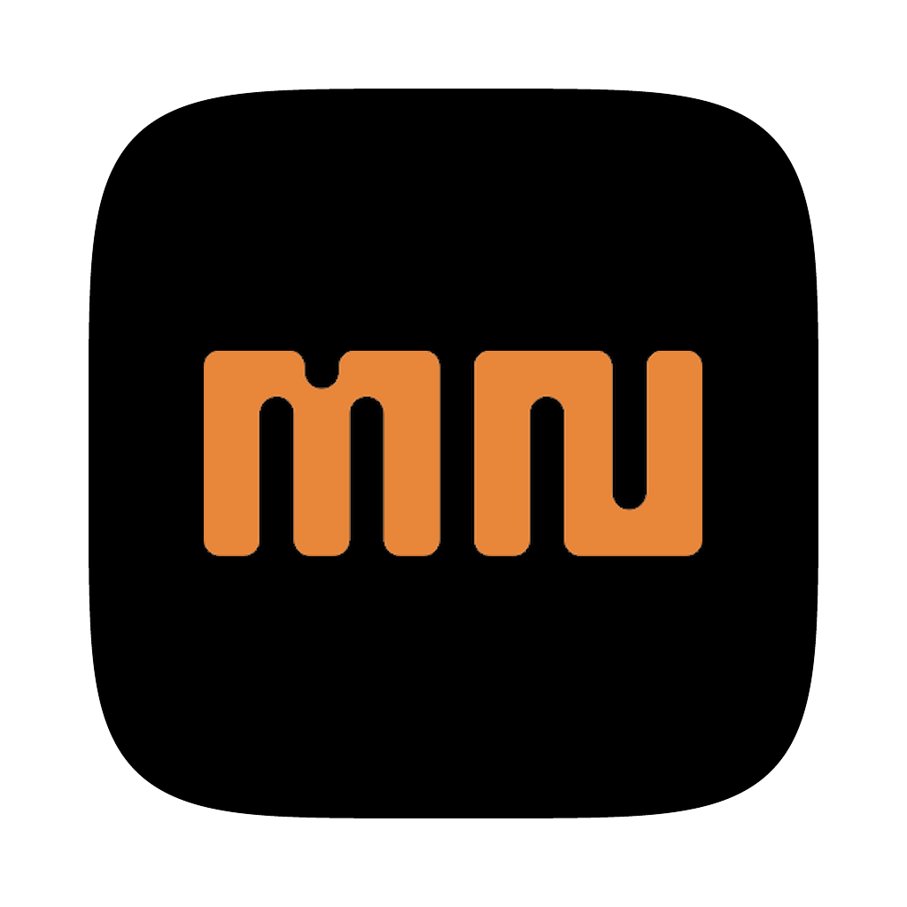

# Micronegative

### A darkroom that runs on your desk

Not a filter pack. An emulsion — measured stocks, real grain structure, halation that blooms where
the light actually was. Everything happens on your machine. Nothing is uploaded, ever.

**[⬇ Download for macOS](../../releases/latest)** · **[Open it in a browser](https://micronegative.com)**

---

## Load the negative

Drop a card of Sony A1 or Fujifilm frames in and they come up as fast as you can arrow through them.
A 42MB Leica DNG hits the screen in about a twentieth of a second — Micronegative reads the preview
your camera already wrote instead of grinding the sensor data first.

**Your originals are never touched.** Not converted, not replaced, not moved. The file that came off
the card is the file still on the disk when you're done.

Fujifilm RAF, Sony ARW, Leica and Samsung DNG, Canon, Nikon and the rest — decoded locally, no
cloud, no round trip.

## The light table

Point it at a shoot folder and it builds a contact sheet from what's there. Thumbnails and metadata
only — nothing duplicated, nothing quietly filling your drive. Your library stays in Finder exactly
where you put it.

Every frame is read for when the shutter fired, which body, which lens, at what stop. Throw the
files in any order you like; they land in the order you shot them. Rate, flag, pick — then take the
keepers through.

## The grade

Twenty-nine tools in a chain you can reorder, mask, and switch off one piece at a time. Nothing is
baked until you export.

**Film Emulation** across measured stocks — Portra, Ektar, Gold, Superia, Provia, Ektachrome — with
push and pull, print path, and per-channel toe and shoulder.

**Grain** modelled as silver crystals rather than noise: ISO, density, chroma and the scan
resolution it's read at. The loupe lays out seven stocks from 50 to 3200 so you choose it by eye,
against your own frame, not by dragging a number.

**Colour Wander** lets a colour run out of its own saturation points and along the exposure, the way
a wet emulsion bleeds — with an overlay that shows you exactly how far it's reaching.

**Halation** round the highlights. **Diffusion** for the filter over the lens. **Cinema Looks** with
a contact sheet cut from your own picture. A **Lens** stage with real flare, anamorphic streaks,
bokeh shaped by aperture blades, and falloff toward the corners.

Underneath it: zones and curves, lift/gamma/gain, HSL and split toning, highlight roll-off, gradient
and radial masks, clone & heal, sky recovery, and a facelift pass that finds the face itself.

## It stays on your machine

Object selection, erase & heal, depth, face landmarks and sky all run locally — the models travel
inside the app, so it works with the network unplugged. No account. No telemetry. Nothing uploaded.
The only network request this editor ever makes is fetching model weights, and it asks first.

---

## Installing on macOS

The build is **unsigned**, so macOS will refuse it the first time.

1. Open the DMG and drag **Micronegative** into Applications.
2. **Right-click the app → Open → Open.** A double-click won't offer the choice. Once only.

If it still refuses:

```
xattr -dr com.apple.quarantine /Applications/Micronegative.app
```

Requires macOS 10.12+ on Apple silicon. 490MB, because the models come with it.

## Or don't install anything

The same editor runs at **[micronegative.com](https://micronegative.com)**. Cataloguing a folder in
place needs the File System Access API, so that one feature wants Chrome, Edge or Opera; everything
else works anywhere.

---

Source is not currently public — this repository exists to distribute the builds.
